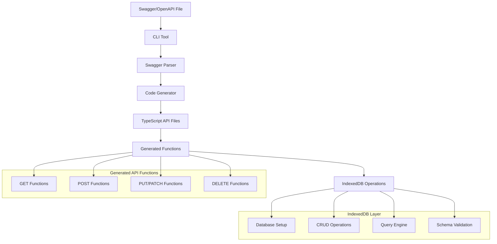
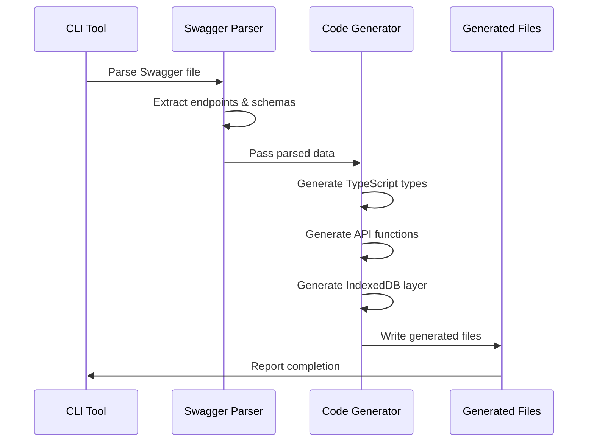

# Swagger to Local DB CLI Tool - Project Plan

## Overview
Create a CLI tool that parses Swagger/OpenAPI specifications and generates TypeScript API files that mock real API behavior using IndexedDB for local development.

## Project Goals
- Generate TypeScript API files from Swagger/OpenAPI specifications
- Mock API behavior using IndexedDB for frontend development
- Provide realistic response structures with proper HTTP status codes
- Include data validation based on Swagger schema definitions
- Support all HTTP methods (GET, POST, PUT, PATCH, DELETE)
- Enable UI development while backend APIs are being developed separately

## Architecture & Components



## Core Features

### 1. CLI Interface
- Command-line tool with options for input/output paths
- Support for multiple Swagger formats (JSON, YAML)
- Configurable output directory structure
- Progress reporting and error handling

### 2. Swagger Parser
- Parse OpenAPI 3.x and Swagger 2.x specifications
- Extract endpoints, methods, parameters, and schemas
- Handle path parameters, query parameters, and request bodies
- Generate TypeScript interfaces from schema definitions

### 3. Code Generator
- Generate TypeScript API functions for each endpoint
- Create proper function signatures with typed parameters
- Generate response type definitions
- Include JSDoc comments from Swagger descriptions

### 4. IndexedDB Mock Layer
- Database initialization and schema setup
- CRUD operations mapped to HTTP methods:
  - **GET** → Query operations with filtering/pagination
  - **POST** → Create new records with ID generation
  - **PUT/PATCH** → Update existing records
  - **DELETE** → Remove records
- Query parameter handling (filtering, sorting, pagination)
- Path parameter extraction and validation

### 5. Response Simulation
- Realistic HTTP response structures
- Proper status codes (200, 201, 404, 400, 500, etc.)
- Response timing simulation with configurable delays
- Error response generation for validation failures

### 6. Data Validation
- Schema validation using generated TypeScript interfaces
- Request body validation before storage
- Parameter validation (required fields, data types)
- Custom validation rules from Swagger constraints

## Project Structure

```
swagger-to-localdb-cli/
├── src/
│   ├── cli/
│   │   ├── index.ts          # CLI entry point
│   │   ├── commands.ts       # Command definitions
│   │   └── options.ts        # CLI options parsing
│   ├── parser/
│   │   ├── swagger-parser.ts # Swagger/OpenAPI parsing
│   │   ├── schema-parser.ts  # Schema extraction
│   │   └── endpoint-parser.ts # Endpoint extraction
│   ├── generator/
│   │   ├── code-generator.ts # Main code generation
│   │   ├── api-generator.ts  # API function generation
│   │   ├── type-generator.ts # TypeScript type generation
│   │   └── db-generator.ts   # IndexedDB layer generation
│   ├── templates/
│   │   ├── api-function.hbs  # API function template
│   │   ├── types.hbs         # TypeScript types template
│   │   └── db-layer.hbs      # IndexedDB layer template
│   └── utils/
│       ├── file-utils.ts     # File operations
│       ├── validation.ts     # Validation utilities
│       └── helpers.ts        # Common utilities
├── templates/              # Handlebars templates
├── tests/                 # Test files
├── examples/              # Example Swagger files
└── docs/                  # Documentation
```

## Generated Output Structure

```
generated-api/
├── types/
│   ├── index.ts          # All TypeScript interfaces
│   ├── user.types.ts     # User-related types
│   └── product.types.ts  # Product-related types
├── api/
│   ├── index.ts          # API exports
│   ├── user-api.ts       # User API functions
│   └── product-api.ts    # Product API functions
├── db/
│   ├── index.ts          # Database setup
│   ├── user-db.ts        # User database operations
│   └── product-db.ts     # Product database operations
└── config/
    └── api-config.ts     # Configuration options
```

## Implementation Flow



## HTTP Method to IndexedDB Mapping

### GET Operations
- Query IndexedDB with filtering capabilities
- Support for path parameters (e.g., `/users/{id}`)
- Support for query parameters (filtering, sorting, pagination)
- Return 404 if resource not found
- Return 200 with data if found

### POST Operations
- Validate request body against schema
- Generate unique ID for new records
- Store in IndexedDB
- Return 201 with created resource
- Return 400 for validation errors

### PUT/PATCH Operations
- Find existing record by ID
- Validate request body
- Update record in IndexedDB
- Return 200 with updated resource
- Return 404 if resource not found
- Return 400 for validation errors

### DELETE Operations
- Find existing record by ID
- Remove from IndexedDB
- Return 204 for successful deletion
- Return 404 if resource not found

## Key Technical Decisions

1. **Handlebars Templates**: Use Handlebars for code generation templates to maintain flexibility
2. **TypeScript First**: Generate fully typed TypeScript code with proper interfaces
3. **Modular Architecture**: Separate concerns (parsing, generation, database operations)
4. **Error Handling**: Comprehensive error handling with meaningful messages
5. **Configuration**: Allow customization of generated code behavior
6. **Testing**: Include unit tests for all major components

## Dependencies

### Core Dependencies
- `commander`: CLI framework
- `swagger-parser`: Parse Swagger/OpenAPI specifications
- `handlebars`: Template engine for code generation
- `typescript`: TypeScript compiler and types
- `yaml`: YAML file parsing

### Development Dependencies
- `@types/node`: Node.js type definitions
- `jest`: Testing framework
- `ts-node`: TypeScript execution
- `eslint`: Code linting
- `prettier`: Code formatting

## CLI Usage Examples

```bash
# Basic usage - generate API files from Swagger spec
npx swagger-to-localdb generate ./swagger.json --output ./src/api

# With custom configuration
npx swagger-to-localdb generate ./api-spec.yaml --output ./generated --config ./config.json

# Generate with specific database name
npx swagger-to-localdb generate ./swagger.json --output ./api --db-name "myAppDB"

# Generate with custom delay simulation
npx swagger-to-localdb generate ./swagger.json --output ./api --delay 500

# Verbose output
npx swagger-to-localdb generate ./swagger.json --output ./api --verbose
```

## Configuration Options

```json
{
  "dbName": "mockApiDB",
  "responseDelay": 200,
  "enableLogging": true,
  "errorRate": 0.1,
  "outputFormat": "typescript",
  "includeValidation": true,
  "generateTests": false
}
```

## Generated API Usage Example

```typescript
// Generated API usage in React component
import { getUserById, createUser, updateUser, deleteUser } from './generated-api/api/user-api';
import { User } from './generated-api/types/user.types';

const UserComponent = () => {
  const [user, setUser] = useState<User | null>(null);
  
  useEffect(() => {
    const fetchUser = async () => {
      try {
        const response = await getUserById('123');
        setUser(response.data);
      } catch (error) {
        console.error('Failed to fetch user:', error);
      }
    };
    fetchUser();
  }, []);

  const handleCreateUser = async (userData: Omit<User, 'id'>) => {
    try {
      const response = await createUser(userData);
      console.log('User created:', response.data);
    } catch (error) {
      console.error('Failed to create user:', error);
    }
  };

  const handleUpdateUser = async (id: string, userData: Partial<User>) => {
    try {
      const response = await updateUser(id, userData);
      console.log('User updated:', response.data);
    } catch (error) {
      console.error('Failed to update user:', error);
    }
  };

  const handleDeleteUser = async (id: string) => {
    try {
      await deleteUser(id);
      console.log('User deleted');
    } catch (error) {
      console.error('Failed to delete user:', error);
    }
  };

  // ... rest of component
};
```

## Development Phases

### Phase 1: Core Infrastructure
- [ ] Set up project structure
- [ ] Create CLI framework with commander
- [ ] Implement basic Swagger parsing
- [ ] Create file generation utilities

### Phase 2: Code Generation
- [ ] Implement TypeScript type generation
- [ ] Create API function templates
- [ ] Generate IndexedDB layer
- [ ] Add JSDoc comments

### Phase 3: IndexedDB Integration
- [ ] Implement database setup
- [ ] Create CRUD operations
- [ ] Add query parameter handling
- [ ] Implement response simulation

### Phase 4: Validation & Error Handling
- [ ] Add schema validation
- [ ] Implement error responses
- [ ] Add parameter validation
- [ ] Create comprehensive error handling

### Phase 5: Testing & Documentation
- [ ] Write unit tests
- [ ] Create integration tests
- [ ] Add example projects
- [ ] Write comprehensive documentation

### Phase 6: Advanced Features
- [ ] Add configuration options
- [ ] Implement response timing
- [ ] Add logging capabilities
- [ ] Create debugging tools

## Success Criteria

1. **Functional**: Successfully generates TypeScript API files from Swagger specifications
2. **Type Safety**: All generated code is fully typed with proper TypeScript interfaces
3. **Realistic**: Mock APIs behave like real APIs with proper HTTP responses
4. **Validation**: Request/response validation based on Swagger schemas
5. **Usability**: Simple CLI interface with clear documentation
6. **Performance**: Efficient IndexedDB operations with good performance
7. **Maintainability**: Clean, modular code structure with comprehensive tests

## Risk Mitigation

1. **Complex Swagger Specs**: Start with simple specs and gradually add complexity
2. **IndexedDB Limitations**: Provide fallback options and clear error messages
3. **Type Generation**: Validate generated types against expected schemas
4. **Browser Compatibility**: Test with multiple browsers and provide compatibility notes
5. **Performance**: Optimize IndexedDB operations and provide performance monitoring

This comprehensive plan provides a solid foundation for implementing the Swagger to Local DB CLI tool with all the requested features and capabilities.